# Hey, I'm X-302-X 👋

**UmbraNet · aspiring developer · lifelong learner**

🌐 <b>English</b> · <a href="./README.ru.md">Русский</a>

## 🧰 Tech I use

  <picture>
    <source media="(prefers-color-scheme: dark)" srcset="./assets/rows/skills-dark.svg" />
    <source media="(prefers-color-scheme: light)" srcset="./assets/rows/skills-light.svg" />
    
  </picture>

  <picture>
    <source media="(prefers-color-scheme: dark)" srcset="./assets/rows/tools-dark.svg" />
    <source media="(prefers-color-scheme: light)" srcset="./assets/rows/tools-light.svg" />
    
  </picture>

## 🚀 Projects

### 👾 [UmbraNet](https://github.com/X-302-X/UmbraNet)

**Secure DNS, network diagnostics and repair for Windows — in one window.**

A desktop app built with PySide6 that bundles three things:

- **traffic engine** — switchable TLS/QUIC strategies, stored in one place and swapped in a click;
- **its own encrypted DNS server** — DoH / DoQ / DNSCrypt with cache, bogus-IP protection that detects provider stubs, automatic failover to the fastest provider and a fallback when everything else is down;
- **diagnostics & repair** — DNS leak checks, one-click rollback of network settings, and a separate watchdog process that restores DNS even after a crash.

Python · PySide6 · WinDivert · GPLv3 · 4 built-in themes

## 🐍 Contribution snake

  <picture>
    <source media="(prefers-color-scheme: dark)" srcset="https://raw.githubusercontent.com/X-302-X/X-302-X/output/github-contribution-grid-snake-dark.svg" />
    <source media="(prefers-color-scheme: light)" srcset="https://raw.githubusercontent.com/X-302-X/X-302-X/output/github-contribution-grid-snake.svg" />
    
  </picture>

**The future is under control** 👻

