# Привет, я X-302-X 👋

**UmbraNet · начинающий разработчик · учусь всю жизнь**

## 🧰 Что я использую

  <picture>
    <source media="(prefers-color-scheme: dark)" srcset="./assets/rows/skills-dark.svg" />
    <source media="(prefers-color-scheme: light)" srcset="./assets/rows/skills-light.svg" />
    
  </picture>

  <picture>
    <source media="(prefers-color-scheme: dark)" srcset="./assets/rows/tools-dark.svg" />
    <source media="(prefers-color-scheme: light)" srcset="./assets/rows/tools-light.svg" />
    
  </picture>

## 🚀 Проекты

👾 [**UmbraNet**](https://github.com/X-302-X/UmbraNet) · защищённый DNS, диагностика и восстановление сети на Windows

## 🐍 Змейка вклада

  <picture>
    <source media="(prefers-color-scheme: dark)" srcset="https://raw.githubusercontent.com/X-302-X/X-302-X/output/github-contribution-grid-snake-dark.svg" />
    <source media="(prefers-color-scheme: light)" srcset="https://raw.githubusercontent.com/X-302-X/X-302-X/output/github-contribution-grid-snake.svg" />
    
  </picture>

**Будущее под контролем** 👻

